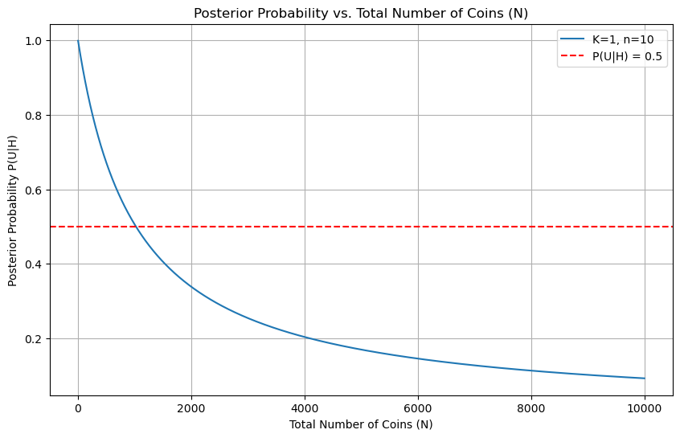
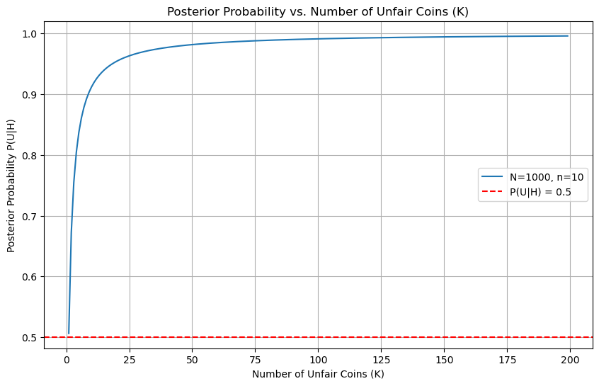
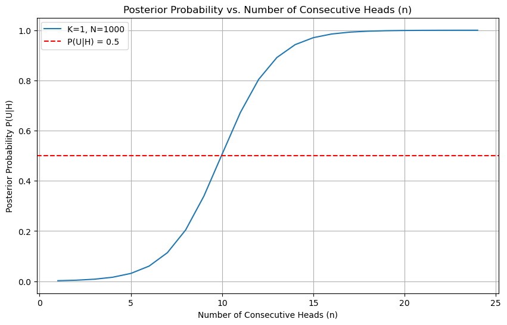
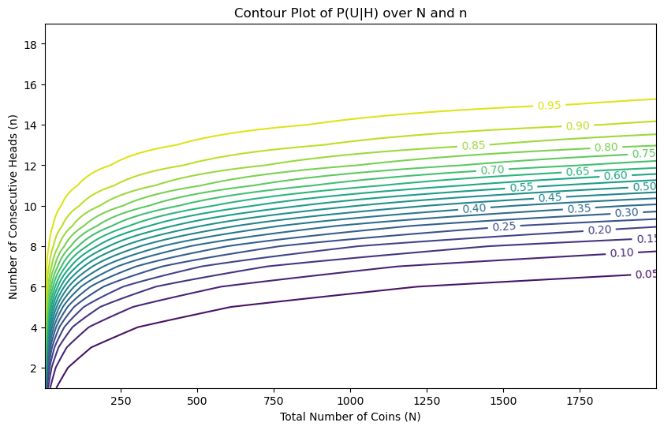

# Graphs and Research on Coin Problem


```python
import numpy as np
import matplotlib.pyplot as plt

# Function to compute the posterior probability P(U|H)
def posterior_probability(K, N, n):
    numerator = K 
    denominator = K + (N - K) * (0.5) ** n
    return numerator / denominator

def plot_posterior_vs_N(K=1, n=10, N_max=5000):
    N_values = np.arange(K + 1, N_max)
    probabilities = [posterior_probability(K, N, n) for N in N_values]

    plt.figure(figsize=(10, 6))
    plt.plot(N_values, probabilities, label=f'K={K}, n={n}')
    plt.axhline(0.5, color='r', linestyle='--', label='P(U|H) = 0.5')
    plt.xlabel('Total Number of Coins (N)')
    plt.ylabel('Posterior Probability P(U|H)')
    plt.title('Posterior Probability vs. Total Number of Coins (N)')
    plt.legend()
    plt.grid(True)
    plt.show()

def plot_posterior_vs_K(N=1000, n=10, K_max=100):
    K_values = np.arange(1, K_max)
    probabilities = [posterior_probability(K, N, n) for K in K_values]

    plt.figure(figsize=(10, 6))
    plt.plot(K_values, probabilities, label=f'N={N}, n={n}')
    plt.axhline(0.5, color='r', linestyle='--', label='P(U|H) = 0.5')
    plt.xlabel('Number of Unfair Coins (K)')
    plt.ylabel('Posterior Probability P(U|H)')
    plt.title('Posterior Probability vs. Number of Unfair Coins (K)')
    plt.legend()
    plt.grid(True)
    plt.show()

def plot_posterior_vs_n(K=1, N=1000, n_max=20):
    n_values = np.arange(1, n_max)
    probabilities = [posterior_probability(K, N, n) for n in n_values]

    plt.figure(figsize=(10, 6))
    plt.plot(n_values, probabilities, label=f'K={K}, N={N}')
    plt.axhline(0.5, color='r', linestyle='--', label='P(U|H) = 0.5')
    plt.xlabel('Number of Consecutive Heads (n)')
    plt.ylabel('Posterior Probability P(U|H)')
    plt.title('Posterior Probability vs. Number of Consecutive Heads (n)')
    plt.legend()
    plt.grid(True)
    plt.show()


plot_posterior_vs_N(K=1, n=10, N_max=10000)
plot_posterior_vs_K(N=1000, n=10, K_max=200)
plot_posterior_vs_n(K=1, N=1000, n_max=25)

```


    

    


    

    


    

    


# Looking Further at Proability Paths


```python
def plot_contour_N_n(K=1, N_max=2000, n_max=20):
    N_values = np.arange(K + 1, N_max)
    n_values = np.arange(1, n_max)
    N_grid, n_grid = np.meshgrid(N_values, n_values)
    probabilities = np.vectorize(posterior_probability)(K, N_grid, n_grid)

    plt.figure(figsize=(10, 6))
    cp = plt.contour(N_values, n_values, probabilities, levels=20)
    plt.clabel(cp, inline=True, fontsize=10)
    plt.xlabel('Total Number of Coins (N)')
    plt.ylabel('Number of Consecutive Heads (n)')
    plt.title('Contour Plot of P(U|H) over N and n')
    plt.show()

plot_contour_N_n(K=1, N_max=2000, n_max=20)

```


    

    

